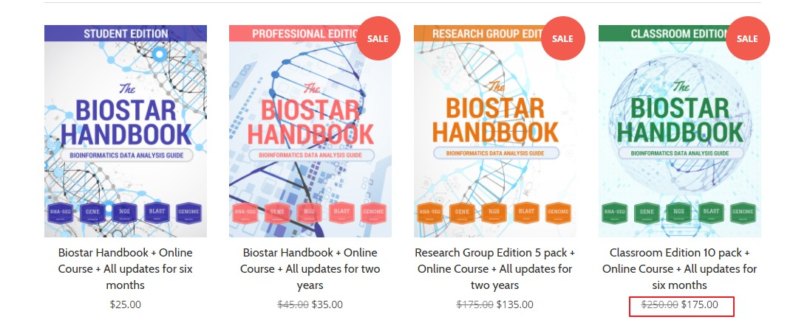

<!-- @import "[TOC]" {cmd="toc" depthFrom=1 depthTo=6 orderedList=false} -->
<!-- code_chunk_output -->

* [deadline就是生产力](#deadline就是生产力)
	* [计划](#计划)
	* [后续](#后续)

<!-- /code_chunk_output -->

# deadline就是生产力

曾经在某一期“奇葩说”听到蔡康永说了一个观点，大致内容如下：

> 如果生命是乐章的话，永恒的生命就会只有一个声调。而他将会把奇葩说的录制无限地推到下一次。

如果生命无限长的话，这就意味着我永远都还有机会去做某一件事情，也就是说即便现在不做，以后还有机会，那么不如以后再说。 这就是为什么我和一位在上海工作的朋友说，“我们都在一个城市，肯定经常有聚会见面”之后，在这一年多的时间里就见过一次面的原因吧。

Deadline就是生产力，这告诉我们每一件事情都有最终的期限，这种歌紧迫感逼迫着我们大脑，就像一颗定时炸弹，“滴答滴答”地在你脑海里回想着， 最终不得不抓紧把事情做完。

我有很多“有生之年”系列。很多系列都是一时兴起，于是写了第一篇和第二篇， 后来发现还有其他事情要做，于是就无限期耽搁。所以每当别人说我很有效率的时候，我都会不好意思。因为我的效率并没有那么高，主要是你们催得紧。

这也就是我为什么要创建一个 biostar handbook 学习群的原因。

biostar handbook是我入门生信用到的其中一本教材，对初学者比较友好。我们生信媛也翻译了其中简单版的翻译。当然这本初学者指南的PDF版本（我目前手上的版本）目前已经有26章，700多页。分为如下三个部分：

1. 生信基础: 数据格式和数据库，序列联配，数据可视化，Unix命令行
1. 生信书分析指南: 基因组组装，重测序， RNA-Seq, Chip-Seq, 宏基因组
1. 软件工具使用： 序列比对软件使，质量软件，序列操作

我之前和朋友一起买过一本25美刀的，看了大半，也写了十几篇笔记，给我临门一脚，越过了小白阶段。有一次在生信媛的群里，有人问如何买书，考虑到大家未必有信用卡，并且团购价更优惠. 就萌生了我组织一起买书然后学习的想法。

原书的购买是需要付费，当然如果你努力找找还是能找到PDF，但是至于你会不会看又是另外一回事了，毕竟在这个信息过载的时代，动辄几个G的资料随处可见分享。

购买链接[见这里](https://biostar.myshopify.com/)，提供了4种购买方式。差异仅仅在于团购还是单人，6个月还是2年的更新支持。

## 计划

我是半个理想主义者，我相信大部分知识都可以自己教会自己，而大部分人做不到的原因不太可能是智商不够，可能就是自己没有花足够多的时间在上面。

当然你不能对人太乐观，大家都有惰性，避免惰性一个是通过沉没成本（花钱买了书，不能浪费），一个就是组织一个具有共同目标的学习小队。

因此我想组织一波Biostar Handbook的学习群，人数为10+X。10为组团购买10人份biostar handbook， x为已经购买但希望一起学习的人数，x <=5。

如果你仅仅想组队便宜一点，请别找我，不要浪费一个学习名额。因为加入者必须要自觉符合如下要求

- 每周都要完成一定量的学习任务，我会根据难度进行修改
- 每周都要记录笔记。记录笔记的目的是方便今后复习，还能相互监督学习情况
- 理解什么是正确的提问方式，不要浪费别人太多的时间去猜测你的问题
- ...

当然，每个人都可能在学习过程中会遇到问题，第一种方法就是通过互联网（基本上初学阶段的所有问题都能解决），第二种方法在学习群里面经过讨论共同解决，第三种方法就是加入我的小密圈，向我提问，毕竟我作为一个初学者，久病成良医。

## 后续

我想先开展一期，目前有16名小伙伴同行。 我们会每周在简书的[Biostar Handbook学习小组](http://www.jianshu.com/c/f0edb9e2bb51)上更新笔记。

如果效果不好， 就没有下一期了。