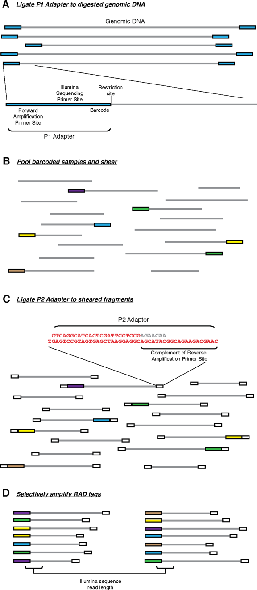
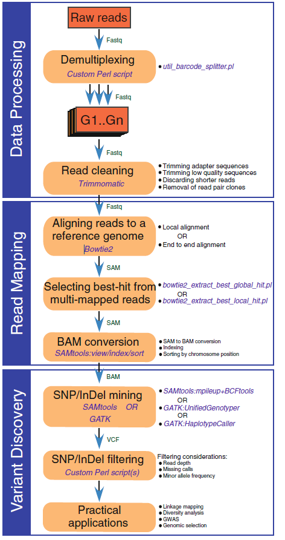
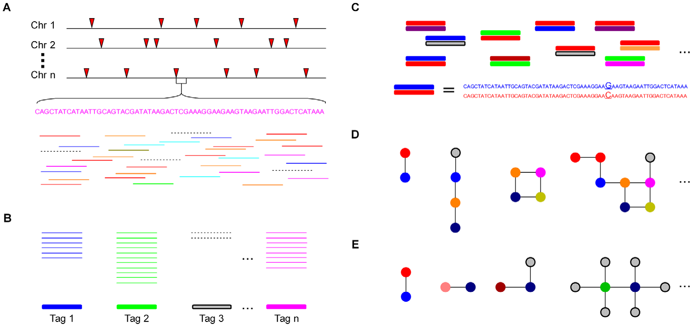

<!-- @import "[TOC]" {cmd="toc" depthFrom=1 depthTo=6 orderedList=false} -->
<!-- code_chunk_output -->

* [RAD-Seq 数据分析](#rad-seq-数据分析)
	* [实验流程](#实验流程)
	* [分析需要考虑的问题](#分析需要考虑的问题)
		* [序列比对和 _de novo_ 组装](#序列比对和-_de-novo_-组装)
		* [Genotype估计](#genotype估计)
	* [数据分析](#数据分析)
		* [多倍体策略](#多倍体策略)
		* [实例部分](#实例部分)

<!-- /code_chunk_output -->

# RAD-Seq 数据分析

## 实验流程

简单而言，分为如下几步：

1. 基因组DNA用限制性内切酶裂解， 然后连接到P1接头。P1接头里含有正向扩增和Illumina测序引物位点，以及4~5 bp 的核酸barcode. barcode至少大于3 bp。
1. 之后接头连接的片段(adapter-ligated fragments)混池，随机打断
1. DNA随后连接到P2接头，反向扩增扩展引物无法连接P2. P2是一种Y型接头，包含P2反向扩增引物位点的反向互补序列，使得不含P1接头的片段无法扩增。
1. 最后仅有同时含P1和P2接头的片段能够上机测序。

实验流程建库过程如图所示：

## 分析需要考虑的问题

### 序列比对和 _de novo_ 组装

分析之前需要考虑的问题是**有无参考基因组**。对于有参物种，考虑到读段长度，存在比对到了重复区(repetitve regions)的reads，或者是multiple alignment， 这些reads可以直接淘汰.

对于无参物种，需要先组装才能继续下一步分析。随后就能确定非重复区的部分的SNP和基因型, 重复区所导致的问题比上面更加严重。有一个表现就是某些区域的深度不可思议的高。

- 旁系同源区域(paralogous regions)由于序列相似导致错误地拼接在一起。这个问题对多倍体而言更加严重。
- focal RAD site 有一定概率抽样次数更多。

对于错误组装的旁系同源区域，有如下手段：

- 提高读段长度，且双端测序,用于提高区分度
- 如果数据来源于群体的不同个体，那么Hardy Webinberg Equilibrium(HWE)能用于找到有问题且不正确识别的基因型, 即旁系同源基因(problematic, incorrect。ly identifified "genotypes" that are really paralogous regions)

> 举例说明：对于一个群体而言，等位基因A应该存在AA，Aa, aa，这几种情况。等位基因B也应该存在BB, Bb, bb. 如果等位基因A和等位基因B错误地组装成一个基因，那么结果原本应该分别比对的reads，最后全部比对到A和B上，那么每一个群体相对A和B来说都是杂合，不存在纯合。

**一些方法**: 如果一个SNP是真实有效的，那么他的频率应该和周围由于机器误差和比对软件误差所产生的假SNP有显著性差异.对于群体的SNP而言，如果同源基因错误组装，那么一个基因上就有大量(超过3个)的SNP位点^[SNP Discovery and Genotyping for Evolutionary Genetics Using RAD Sequencing].

### Genotype估计

由于存在测序错误和抽样偏差，会导致重头组装过程中产生错误地拼接了旁系同源基因。除了提高深度和reads长度以外，比较好的解决方案就是统计模型(statistical framework).

比如说根据二倍体建立的极大似然法模型:

$$
L(1,1) = P(n_1, n_2, n_3, n_4 |1,1) = \frac{n!}{n_1!n_2!n_3!n_4!}(1 - \frac{3e}{4})^{n_1}(\frac{e}{4})^{n_2+n_3+n_4}
$$
$$
L(1,2) = P(n_1, n_2, n_3, n_4 |1,2) = \frac{n!}{n_1!n_2!n_3!n_4!}(0.5 - \frac{e}{4})^{n_1+n_2}(\frac{e}{4})^{n_3+n_4}
$$

**系统误差**：杂合位点上不同等位基因的reads频率由于PCR扩增偏好性引起的差异。以及barcode时期的抽样误差。可以通过优化实验流程减少PCR扩增循环来降低误差。**暂时没有相应方法解决**

## 数据分析

Genotyping-By-Sequencing的pipeline有两类：

- reference-based: TASSEL-GBS, Stacks, IGST, Fast-GBS
- _de novo_-based: UNEAK, Stacks, GBS-SNP-CROP

数据分析的大体流程如下^[Analysis of Genotyping-by-Sequencing (GBS) Data]

基本上都要经过以下几步^[Fast-GBS: a new pipeline for the efficient and highly accurate calling of SNPs from genotyping-by-sequencing data]：1) 获取原始数据, 2) 混池多标签标记的reads数据分离, 3) 过滤低质量reads, 4) 组装或者比对序列, 5) 寻找多态位点并从中找到与表型相关的位点。

### 多倍体策略

2012年在Plot Genetics发表了一篇文章，利用UNEAK^[Switchgrass Genomic Diversity, Ploidy, and Evolution: Novel Insights from a Network-Based SNP Discovery Protocol] 分析高度杂合多倍体化且无参考基因组的物种，Switchgrass(_Panicum virgatum_ L.)， 分析框架示意图如下：

A图：将read切割成64bp, 用来避免两段的测序错误。

B图： 相同的64-bp 折叠成(collapsed into)标签(tags).

C图：配对联配(pairwise alignment)识别tag pair中的单个碱基差异，即候选SNP。

D图：由于基因组的复杂性，许多tag pair会形成网络。

E图： 一般复杂的网络都属于重复区，旁系同源和错误的tags。

但是这个软件已经不再开发了，因为它只能找到1/4可能的SNP位点^[<https://groups.google.com/forum/#!topic/tassel/8x_T_nShs50>]. [TASSEL](https://groups.google.com/forum/#!forum/tassel)建议构建一个不太贵的pseduo reference用于比对，比如说HiSeq 2500 2x250 run.当然还有一个UNEAK替代流程，[GBS-SNP-CROP](
https://github.com/halelab/GBS-SNP-CROP.git)值得一试。

### 实例部分