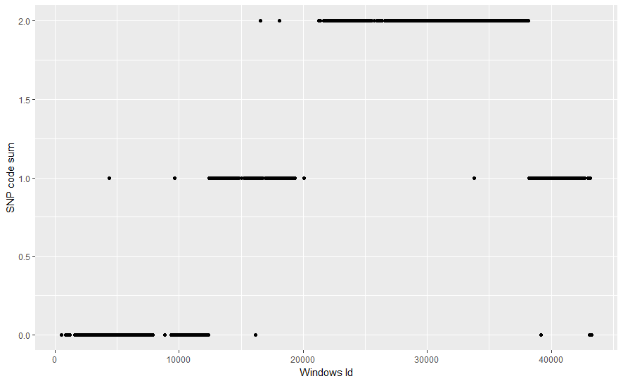
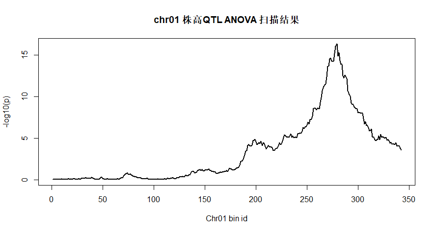

<!-- @import "[TOC]" {cmd="toc" depthFrom=1 depthTo=6 orderedList=false} -->
<!-- code_chunk_output -->

* [使用binmap进行遗传定位](#使用binmap进行遗传定位)
	* [什么是binmap](#什么是binmap)
	* [基本概念](#基本概念)
	* [binmap 实战第一天](#binmap-实战第一天)
		* [第一步：数据读取](#第一步数据读取)
		* [第二步：chr1染色体SNP分布图](#第二步chr1染色体snp分布图)
		* [第三步：构建Windows基因型](#第三步构建windows基因型)
		* [第四步：SUM值转换基因型值](#第四步sum值转换基因型值)
		* [第五步：修正可能的错误](#第五步修正可能的错误)
			* [Tips: rle函数小讲](#tips-rle函数小讲)
		* [第六步：整理结果](#第六步整理结果)
		* [QTL扫描](#qtl扫描)

<!-- /code_chunk_output -->

# 使用binmap进行遗传定位

## 什么是binmap

基因组时代，BSA，Binmap，GWAS是遗传学的三大宝刀。

* BSA最省时、省力、省钱，但是需要你有**好的材料**，进行**合理实验设计**。很多同学都被测序公司骗，以为什么都能BSA，甚至自己都不清楚自己的群体分离比究竟咋回事，就混池测序，只会越混越乱。
* Binmap是最**中规中矩**的实验设计，需要你构建群体，对群体中每个单株进行测序和考察表型，这有点小烦人。但是随着测序成本的降低，相对于BSA也多花不了几个钱，个人还是非常推崇这种稳扎稳打，步步为营的遗传学方法。
* GWAS其实是最懒的实验设计(我指的是对某些异想天开的实验室)。为什么说他懒，因为很多人都是从别人那里拿来种质资源，考察表型，然后交给公司测序，拿来SNP数据，甚至后续分析都是公司搞定。很多都是发文章**一锤子买卖**，很难有下文，图的就是短平快。非常符合当下对SCI，IF充满着饥渴的科研环境。很多需要对材料群体结构进行精细考量，对关注的表型进行系统设计的环节被完全省略，完全变成了#比钱多，比材料多的比大小游戏。

**小结**： 相对简单粗暴的GWAS而言，BSA和Binmap都更需要关注一些的生物学问题，脑袋非常清楚的去发现，甚至创造材料，进行实验设计。要不很难有好的实验结果。当然我们也需要在群体水平和应用方向上挖掘信息，提高我们研究的意义和质量。

## 基本概念

前段时间介绍过[BSA](https://xuzhougeng.shinyapps.io/biosxy/)，今天就来讲Binmap。前部分是基本概念介绍，后面是代码实现。老少皆宜，适合睡前十分钟看完，然后动动手指头转发、点赞、打赏、拍砖等一系列睡前非理智行为。留在白天，在R中复制粘贴代码，十分钟之后，困扰你几年已久的binmap构建完成，几秒之后QTL扫描完成。

bin在基因组学上其实有两个概念，一个等同于大家熟悉的window(plink的官方文档有涉及，不知所云代表你不需要知道)；另外一个侧重于遗传学，它是指在一个分离群体中，**没有发生重组的染色体区块**。后面一个概念有点绕。什么意思？

我们都知道一个个体要去生孩子，就要先发生减数分裂产生配子，减数分裂过程染色体会随机重组，发生交换，这个交换位点在染色体上是“随机的”。一个F1自交产生了200个小娃娃，这200个小娃娃的400条染色体就会发生很多次交换，但是注意这些交换位点是随机，那么就会有些区段，一次交换也没有，一次交换也没有，一次交换也没有。一次交换也没有怎么办？那就不换呗。不换怎么办？那这段就是一个bin呗。

沃特，还不明白？或者你本来明白，被绕的晕乎乎的。这个时候你室友叫你来斗地主，正和你意！第一盘，你上来就是双王，王炸下去，赢了一盘。然后第二盘，你叫了地主，翻起底盘，亮瞎了你的“人”眼，底盘留着双王。你室友肯定大叫，“这怎么洗的牌！牌没洗净，重来！” “啥，牌没洗净？！” 对，就是没洗净，上次连着，洗牌后，还连着，中间一点没交换交换。对！这就是bin啊，中间没交换。你恍然大迷瞪。哦，bin就是基因组上这一块，洗牌时候，没交换，没洗净，以至于出现在下一代时候，还连在一块没打断啊！

这个时候，你可能理解了概念，那咱就来一个专业点的小故事再来两个疗程，巩固巩固，看下图。


图1：一个简单的F2群体信息

如图1“小”的单倍体小物种，染色体非常小，whole genome只有10个碱基。小爹，小妈的10个碱基都有差异。小爹小妈有一个孩子，这个孩子长大后，自交生下了3个孩子。这三个孩子就是一个小小的F2群体。三个孩子的染色体各发生一次交换，小1断点发生在第6、7个碱基之间，小2断点发生在第5、6个碱基之间，小3断点发生在第2、3碱基之间。通过比对之后，发现三个个体组成的群体中第1、2碱基之间没有发生交换，于是这两个碱基就是一个bin，第3-5个碱基也是一个bin，第6-7个碱基是一个bin，第8-10个碱基是一个bin。

如果我们把小妈基因型code0，小爹基因型code成1。三个个体基因型整理成如下格式：


表1：“小”物种三个F2个体的binmap

这下你眼熟了吧。好，本节到此结束，明晚用一个水稻的实际数据进行Binmap实战。

## binmap 实战第一天

binmap构建的流程：

1. 选定一个单株，通过plot查看chr01上SNP情况，了解大致的纯和区域和杂合区域。
1. 通15个SNP一个window的滑动窗口，从头到尾滑动，通过15个SNP sum值得到这个材料chr01上转换成window的基因型
1. 通过window周围的基因型信息，对错误的基因型进行修正
1. 根据window基因型信息，判断染色体上的重组断点，即构建选定单株的chr01上的bin
1. 对群体中的每个材料chr01进行bin推定，然后把群体中的这些断点，沿着chr01从头到尾排列，整合成出来chr01的binmap(回看图1)


下面是一个实际的案例，数据来自水稻的一个F2群体，一共167个个体，表型是株高，通过RADseq获得了每个个体的SNP数据.

数据链接：[百度云盘](http://pan.baidu.com/s/1c2OvL3E) 密码：fm5l。当然，我们还把数据上传到GitHub上，可以在R里面获取数据。

为便于大家学习，对数据进行了初步整理：每个SNP根据亲本基因型，P1基因型code成0，P2基因型code成2，杂合基因型code成1，NA为缺失。部分数据图示如下


表2：水稻167个个体的F2群体chr01SNP部分数据

这里仅用第一染色体的9875个SNP来学习, 详见文件。这种格式怎么整理？其实这是数据的基本处理，exel可以搞定，请自学两天的R，或者请多来生信媛学习，另外测序公司可以帮你搞定，搞不定果断怼他。

下面开始构建binmap，我们是逐个材料，逐条染色体开始构建。让我们先开始分析B10.10。

### 第一步：数据读取

数据分为两类：每个样本表型数据以及每个样本的SNP数据（约等于基因型数据），遗传定位的目的主要就是将表型于基因型一一对应。

```r
# readr的read_csv读取速度更快
library(readr)
# snp data
snp_url <- 'https://raw.githubusercontent.com/xuzhougeng/zgtoolkits/master/chr01.snp.csv'
snp_data <- read_csv(file=snp_url)

snp_info <- snp_data[,1:4]
snp_type <- snp_data[,-c(1:4)]

# phenotype data
phe_url <- 'https://raw.githubusercontent.com/xuzhougeng/zgtoolkits/master/phe.csv'
phe_data <- read_csv(phe_url)

# 以上数据请用head, tail函数检查看下数据内容
```

### 第二步：chr1染色体SNP分布图

简单的两行代码，这里是重点，敲黑板，睡觉的同学醒醒，我们需要盯着画出来的图2看上两分钟。

```r
# 编辑使用ggplot2绘图
library(ggplot2)
b10.10_chr1 <- data_frame(pos = snp_info$POS, snp_type = snp_type$B10.10)
p1 <- ggplot(b10.10_chr1, aes(x=pos, y=snp_type)) + geom_point()
p1 + scale_x_continuous(labels = function(x) return(paste0(x/1000))) +
   xlab("position") + ylab("SNP type")
```


图2：B10.10个体，chr01 SNP情况

对于B10.10这个个体，chr01基本分为四个区域，分别为ABCD：A区域，大部分是亲本1的基因型，即SNP状态是0；区域B，SNP0,1,2状态都有，也就是两个亲本和杂合都有，区域C主要是亲本2基因型；区域D和B类似。为什么会这样呢？我们一般对于一个群体的每个个体是低覆盖度测序的，注意“低覆盖度”，那么对于A区域可以理解为，这一块就是亲本1的基因型，至于散落的code的1和2的状态，主要是测序错误和重复区域的snp calling的错误导致。对于B区域，这是一个杂合区段，如果两条染色体上我们都测到了，那么这个SNP就会检测出来是杂合的，但是如果只测了一倍的覆盖度，也就是只测到了一条染色体，就测成纯和基因型了，就是随机测成亲本1或者亲本2，所以才会出现三种情况都有。对于区域C，这一块就是亲本2的基因型，区域D也是杂合区域，同样有些错误的基因型。

以上问题主要是因为我们测序的低覆盖度造成的，我们通过提高覆盖度可以解决以上问题，但是对于我们F2群体的使用目的也就是初步定位，没必要花几百万干这种事，我们可以通过另外一种方法来矫正这种错误，那就是使用window。

也许只接触一天，你不知道一个人是究竟坏人还是朋友，但是接触上十年了，基本上能让一个人看透了吧。正所谓，日久见人心，SNP多了不怕错。我们我们用一个window囊括15个SNP，25个SNP.....，我们来看这个window的基因型，而不是每个SNP的基因型，这样即便错也错不到哪里去。
我们的基因型已经code成数字形式，那么我们就设一个window15个SNP(跳过缺失的SNP)，Sum一下，那么这个window的值应该是在0-30之间，等于0，即P1的基因型，等于30，即P2的基因型，杂合基因型应该在15左右波动，那是不是这个样子呢，咱来看一下。升级版的基因型来了。

### 第三步：构建Windows基因型

把SNP基因型转换成window基因型，15SNP/per window

```r
wind_sum <- snp_chr1_B10.10 %>% mutate(group = as.numeric(rownames(.)) %/% 15 + 1) %>%
  group_by(group) %>%
  summarise(start = min(POS), end=max(POS), code_sum = sum (code)) %>%
  ungroup()

ggplot(wind_sum, aes(x=start, y = code_sum)) + geom_point() +
  xlab("Windows Id") + ylab("SNP code sum") +
  scale_x_continuous(labels = function(x) return(x / 1000))
```


图3：每个window的SNP sum值

由图3可以看到，图2经过window处理之后，杂合区域不再是三条线，而是围绕15上下波动的一些点。亲本1纯和区域和亲本2纯和区域，也都是预期中的在0和30处的一条直线，外加偏离的一些点。虽然我们期望亲本1基因型值为0，但是总会有个别一些window，会偏离出来，对于亲本2也是这样。

于是需要我们进行技术处理一下，把Sum值小于等于6的window，都当成是亲本1基因型，code成0；把大于等于24的，都当成是亲本2基因型，code成2；把6~24之间的code成1，即杂合区段，我们来看看效果。

### 第四步：SUM值转换基因型值

```r
wind_geno <- mutate(wind_sum, code =
                    ifelse(code_sum < 6, 0, ifelse(code_sum > 24, 2, 1 )))

ggplot(wind_geno, aes(x=start, y = code)) + geom_point() +
  xlab("Windows Id") + ylab("SNP code sum") +
  scale_x_continuous(labels = function(x) return(x / 1000))
```



图4：每个window的基因型plot

由图4可知，图3的杂合区域，基本转成杂合基因型1，但是亲本基因型区域和杂合区域，总有一些点不合群，杂合区域离群点尤其多，这也跟杂合区域call基因型准确率更低有关。那么我就需要对这些潜在的错误window基因型进行修正，修正的方法也很简单，用它周围的window的基因型替换即可（上游下游问题都不大）。

### 第五步：修正可能的错误

```r
fixgeno.func <- function(w.geno,fix.size=NULL){
  wind.geno.rle <- rle(w.geno)
  error.id <- which(wind.geno.rle$lengths < fix.size)
  for(i in error.id){
    left.id <- sum(wind.geno.rle$lengths[1:i]) - wind.geno.rle$lengths[i]
    right.id <- sum(wind.geno.rle$lengths[1:i])
    if(i==1){ w.geno[(left.id+1):right.id] <-  w.geno[right.id+1]
    }else{
      w.geno[(left.id+1):right.id] <- w.geno[left.id]
    }}
  return(w.geno)
}

wind_geno$fix <- fixgeno.func(wind_geno$code, fix.size = 10)

ggplot(wind_geno, aes(x=start, y = fix)) + geom_point() +
  xlab("Windows Id") + ylab("SNP code sum") +
  scale_x_continuous(labels = function(x) return(x / 1000))

```


#### Tips: rle函数小讲

上面代码用到了一个关键函数rle，例子一下

```r
rle(c(1,1,1,2,3,3,3,1,1))
#Run Length Encoding
#  lengths: int [1:4] 3 1 3 2
#  values : num [1:4] 1 2 3 1
```

它返回一个向量某个元素重复的次数。基因型值应该是一连串的0,1,2值，偶尔有一些错误的乱入。那我们fix前的基因型看一下

```r
rle(wind_geno$code)
#Run Length Encoding
#  lengths: int [1:21] 42 1 64 1 54 45 1 10 1 37 ...
#  values : num [1:21] 0 1 0 1 0 1 0 1 2 1 ...
```

根据结果我们知道，在连续出现42个0之后，出现了1个1，然后又是连续64个0。也就是图4中，亲本1基因型区域中第一个乱入的杂合点(其实是6个点画到一块了)。我们就对这个错误的基因型进行替换，在这里我们写了一个fix的函数，可以选取从小到大的fix size从小到大，逐渐修正错误的基因，逐步打磨，得到比较靠谱的基因型结果, 如图5.

### 第六步：整理结果

如上面结果所示，我们已经得到了B10.10这个材料第一条染色体的bin情况，那么我们一次在R里写一个循环可以把剩下的166个材料，剩下的其他染色体bin情况分析一遍，然后信息整合，就得到我们想要的binmap。

现在把我们从头开始的信息在一起回顾下：

```r
bin_map <- gather(wind_geno, key='method', value='value', code_sum:fix)
p1 <- ggplot(bin_map, aes(x=start, y=value)) + geom_point() + facet_grid(method~. , scales = "free")
print(p1)
```


下面我们就是用一个向量，记录167个材料，chr01上所有的断点，每两个断点之间就是一个bin(回顾图1)，整合信息，就得到了一个chr01的物理binmap。

运行下面代码，去泡杯咖啡，不出意外的话，回来之后167个材料，chr01的binmap(物理图谱)，和一个pdf文档已经躺在你的文件夹里了：

```r
setwd("F:/Data/binmap学习/")## 确保chr01的snp文件也在此目录
source("binmap构建.txt")
```

### QTL扫描

那么构建完之后，我们的binmap质量怎么样的，那就把表型导进来扫个QTL试试吧。

```r
# 之前已经导入过
phe_url <- 'https://raw.githubusercontent.com/xuzhougeng/zgtoolkits/master/phe.csv'
phe_data <- read_csv(phe_url)

p <- apply(bin[4:170],1,function(x){
  lm <- lm(phe_data$PH ~ x)
  p.t <- anova(lm)[,5][1]
  return(p.t)
})

par(mfrow=c(1,1))
plot(-log10(p)~c(1:length(p)),pch=20,xlab="Chr01 bin id",main="chr01 株高QTL ANOVA 扫描结果",type="l",lwd=2)
```



碰巧的是水稻里的绿色革命基因，sd1 LOC_Os01g66100 物理区间是 38382382-38385504，距QTL最显著位置只有258kb的距离，对于一个只有172个个体的F2群体而言，结果是不是已经很不错了。
