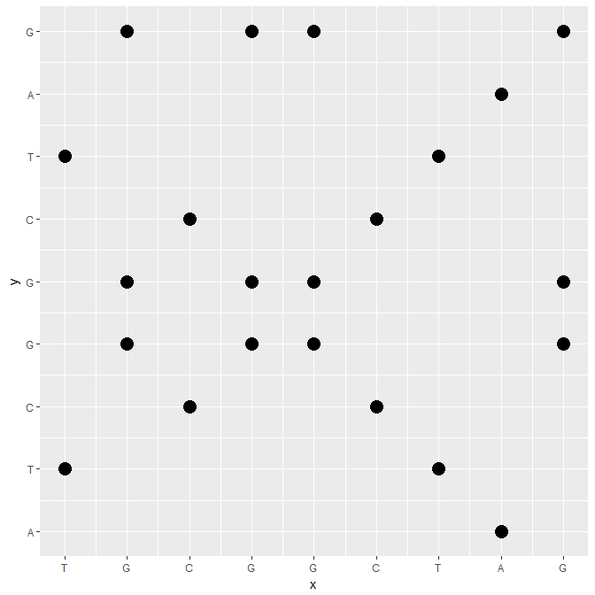

<!-- @import "[TOC]" {cmd="toc" depthFrom=1 depthTo=6 orderedList=false} -->
<!-- code_chunk_output -->

* [序列比对软件的比较和思考](#序列比对软件的比较和思考)
  * [配对序列联配](#PairwiseAlignment)
    * [点阵图分析](#dotMatrix)
    * [数据库搜索](#DatabasesSearch)

<!-- /code_chunk_output -->

# 序列比对软件的比较和思考

面对一段未知的核酸或者氨基酸序列时，估计大部分人的第一反应就是先BLAST一下吧。因为孤立的信息没有任何意义，只有和已知条件建立起联系才能做后续推理。也就是说未知序列需要和已有序列或数据库进行比较，才能做进一步的分析。

按照用途，我将这些比对软件分为以下几类:

- 数据库搜索(Databases Search)，如BLAST, FASTA
- 多序列联配(Multiple Sequence Alignment)，如MAFFT, MUSCLE
- 长序列比对(Large Sequence Alignment), 如MUMer, BLAT, LAST
- 高通量短读比对(Short Reads Alignment)，如BWA, HISAT2，SOAP
- 高通量长读比对(Long Reads Alignment), 如GMAP. STARlong

## 基础：配对序列联配 {#PairwiseAlignment}

最简单的情形是，你手头有两条序列，你想知道这两条序列的关系，也就是这两条序列在进化上的联系，也就是**同源性**(homology).当然，同源还能继续分为以下两种：

- 直系同源(Ortholog): 不同物种有来自于同一祖先的序列
- 旁系同源(paralog) : 由于基因复制在同一物种中出现多次

由于没有时光机，无法确定序列在进化上的关系，只能计算两者在**联配**后的一致度(identity)和相似性(similarity)进行推理。**配对序列联配**的方法有如下几种：

- 点阵图分析(dot-matrix analysis)
- 动态规划算法(dynamic programming algorithm)
- 启发式途径(heuristic approache)

### 点阵图分析 {#dotMatrix}

点阵图是比较两个序列最直观也是最受欢迎的方法。目前已有很多工具用于绘制点阵图，

- [Dotter](http://www.sanger.ac.uk/science/tools/seqtools): 命令行工具
- [JDotter](https://virology.uvic.ca/virology-ca-tools/jdotter/)：可视化工具，可用于全基因组和亚基因组比较
- [YASS](http://bioinfo.lifl.fr/yass/index.php)：可用于比较两个基因组
- [Dotlet](http://myhits.isb-sib.ch/cgi-bin/dotlet)：网页工具

由于原理很简单，就是用(X,Y)表示配对关系，因此这里尝试用R进行作图。

```r
X <- 'TGCGGCTAG'
Y <- 'ATCGGCTAG'
seq.x <- unlist(strsplit(X,''))
seq.y <- unlist(strsplit(Y,''))
# initial the dot matrix
dot.matrix <- matrix(NA, length(seq.x), length(seq.y),
                     dimnames = list(seq.x,seq.y))
# fill the matrix with 1
for (i in 1:length(seq.x)){
  for (j in 1:length(seq.y)){
     if (seq.x[i] == seq.y[j]){
       dot.matrix[i,j] <- 1
     }
  }
}
# 用matrix形式进行展示
dot.matrix
   A  T  C  G  G  C  T  A  G
T NA  1 NA NA NA NA  1 NA NA
G NA NA NA  1  1 NA NA NA  1
C NA NA  1 NA NA  1 NA NA NA
G NA NA NA  1  1 NA NA NA  1
G NA NA NA  1  1 NA NA NA  1
C NA NA  1 NA NA  1 NA NA NA
T NA  1 NA NA NA NA  1 NA NA
A  1 NA NA NA NA NA NA  1 NA
G NA NA NA  1  1 NA NA NA  1

# 先将矩阵以(x,y)的形式转换，使其符合`tidyverse`
seq_mt <- matrix(data=NA, nrow=length(seq.x)*length(seq.y), ncol=2)
flag = 1
for (i in 1:nrow(dot.matrix)){
  for (j in 1:ncol(dot.matrix)){
    if (! is.na(dot.matrix[i,j])){
      seq_mt[flag,1] <- i
      seq_mt[flag,2] <- j
    }
    flag <- flag + 1
  }

}

# ggplot作图
seq_df <- na.omit(as.data.frame(seq_mt))
colnames(seq_df) <- c("x","y")
library(ggplot2)
ggplot(seq_df, aes(x=x,y=y)) + geom_point(size=5) +
  scale_x_continuous(breaks = 1:9, labels = seq.x) +
  scale_y_continuous(breaks = 1:9, labels = seq.y)
```



当然实际的序列会更长也更复杂，会存在大量背景噪音(noise)，常用的方式是利用重叠且固定长度的窗口(slide window)根据最低的一致度进行筛选。虽然点阵图能比较直观展示序列间的相似性，但它无法告诉我们序列到底应该如何联配。给定两条序列，如果允许插入和缺失(indel)，会有多种可选的联配结果，从中选择最优联配需要用到得分矩阵(score matrix)用于对联配碱基赋值和惩罚矩阵用于对空缺进行惩罚。

得分矩阵也称替换矩阵，表示为4X4(核苷酸)或20X20的记分矩阵，。目前比较常用的替换概率矩阵如下：

- PAM: 用于探索蛋白质进化起源
- BLOSUM：寻找保守的蛋白质区域

## 动态规划算法 {#DPA}

## 数据库搜索 {#DatabasesSearch}

数据库搜索估计是目前
