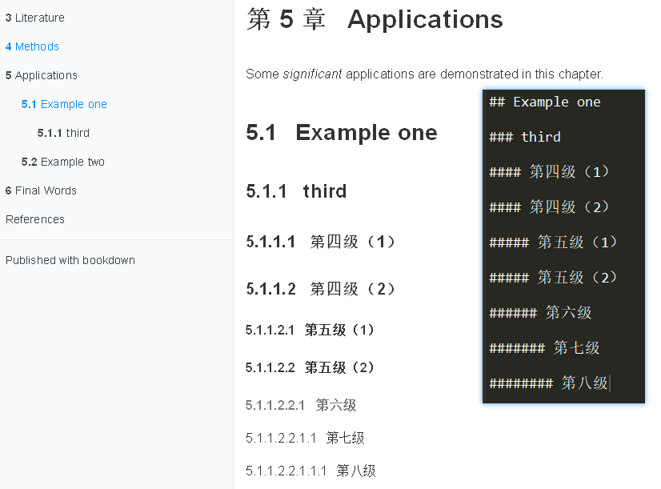
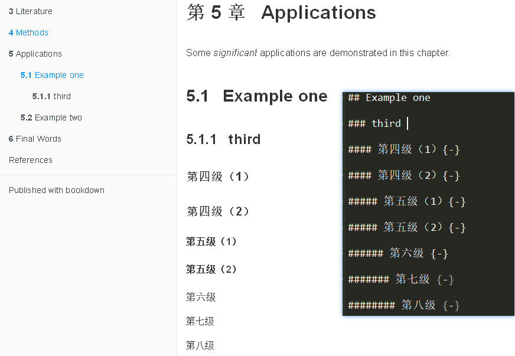

<!-- @import "[TOC]" {cmd="toc" depthFrom=1 depthTo=6 orderedList=false} -->
<!-- code_chunk_output -->

* [如何使用bookdown](#Header)
	* [什么是bookdown](#What)
	* [快速建立一个bookdown](#Setup)
	* [Markdown语法](#syntactic)
		* [基础Markdown语法](#Basic)
		* [bookdown扩充语法](#Expand)
			* [特殊标题 (Special Header)](#SHeader)
			* [索引](#reference)
				* [章节索引](#章节索引)
				* [图表索引](#图表索引)
				* [文本复用](#文本复用)
				* [文献索引](#文献索引)
	* [排版](#typeset)
		* [目录索引](#目录索引)
		* [关于图片和表格](#关于图片和表格)
		* [关于字体](#关于字体)

<!-- /code_chunk_output -->

# 如何使用bookdown {#Header}

## 什么是bookdown {#What}

像我这种轻度强迫症患者，在写作时总会不知觉的关注到排版(typoset)，稍微排版差点就很会影响到写作状态了。 我在大学参加数学建模比赛的时候接触过LaTex，除了蛋疼的图片浮动和表格插入外，它的排版效果是极佳的。 但是最终结果只能生成了PDF，就是一锤子买卖，毕竟我还需要一个word版本。 然而一入word深似海，所见即所得， 但是要自己去折腾标题，一点都不极客范。

## 快速建立一个bookdown {#Setup}

首先你需要保证RStudio IDE(version > 1.0.0)已经安装。并且也安装了`bookdown`

```r
install.packages("bookdown")
```

然后你需要以压缩包的形式下载[bookdown-demo](https://github.com/rstudio/bookdown-demo)，解压缩之后，修改文件夹名和`.Rproject`的文件名，双击就能在RStudio中打开。

`_bookdown.yml`， 以YAML格式设置全局输出。以`_`开始的文件名会被忽略。


随之就可用修改`_bookdown.yml`文件，从而使`bookdown::render_book()`改变渲染方式。

```YAML
# 合并后的markdown文件名
book_filename: bookdown
# clean_book()的输入参数
clean: [packages.bib, bookdown.bbl]
delete_merged_file: true
# RSutdio IDE输出
site: "bookdown::bookdown_site"
output:
  bookdown::gitbook:
    lib_dir: "book_assets"
# 国际化
language:
  lable:
    fig: "图"
    tab: "表"
  ui:
    edit: "编辑"
    chapter_name:  ["第 ", " 章"]
```

接着就是修改一系列章节相关的`.Rmd`文件。形同`01-intro.Rmd`，以开头的数字顺序确定不同文件的前后关系。

最后，通过build的Build Book生成全书。


## Markdown语法 {#syntactic}

### 基础Markdown语法 {#Basic}

最基本的 Markdown 语法基本用手指头都能数清，都不需要动用脚趾头。不过目前比较常用的标准是 **Pandoc** 所支持的语法。

第一类是**段落内格式**, 包括 _italic_ (`_斜体_`), **bold** (`**粗体**`), 字体~下标~(`字体~下标~`)和字体^上标^(字体^上标^)以及内联代码(`code`)。

还可以插入链接`[github](www.github.com)`, 插入图片也没有问题``. 如果你对脚注有需求(`^[脚注]`)，就是这个效果^[脚注]。

第二类是**区块格式**，比如说不同级别的标题，有序列表和无序列表，索引， 代码块用三个反引号(`)开始和结束。

```markdown
# 一级标题

## 二级标题

### 三级标题

* one item
* one item
* one item
    - one item
    - one item
      + one item
      + one item

1. 第一
2. 第二
3. 第三

> 这是一个索引
```

第三类是**数学公式**。如果单独成行，就是用两个美元(\$)开始和结束。如果是行内的数学公式，就只要一个美元符合(\$),如 $\sum_a^b$。

当然你还可以像latex那样使用数学公式。

```equation
$$\begin{array}{ccc}
x_{11} & x_{12} & x_{13}\\
x_{21} & x_{22} & x_{23}
\end{array}$$
```

至于如何写数学公式，请自行百度Latex数学公式。

更多Pandoc的markdown语法见官方文档^[<http://pandoc.org/MANUAL.html#pandocs-markdown>]

### bookdown扩充语法 {#Expand}

仅仅有markdown自带语法，顶多是写一篇文章，要想组织成一本书，还需要更多的扩展语法。

#### 特殊标题 (Special Header) {#SHeader}

**特殊标题**比较常用，比如说一本书的章节数较多，就可用将相关章节组成几个小部分(PART)， 还看可以插入图书附录(APPENDIX)

```markdown
# (PART) 第一部分 {-}

# 第一章

# (APPENDIX) 附录{-}
```

#### 索引 {#reference}

索引分为多种，包括但不限于如下类型：

- 章节索引
- 图表索引
- 文本复用
- 公式索引
- 文献索引

##### 章节索引 {-}

Pandoc会自动根据标题(章节, chapter and section)产生标识符号，当然最好是自己手动在标题后添加`{#id}`。

如果需要索引数字，则是`\@ref(ID)`;如果以标题作为跳转文字，那么`[section header text]`就行; 如果要自定义跳转文字，则是`[link text](#ID)`.

##### 图表索引 {-}

图表索引分为两种情况，是R运行时产生，还是从外部添加。

默认情况下图和表都是没有标题(caption)，也就不会被加入图环境(figure environment)，也就不会被自动标记和计数(labeled and numbered).

> 作图

因此对于图而言，R产生的图需要在代码块(code chunk)中增加`fig.cap`以及前面的代码块标记，比如说 _fig-foo_。 如果外部图片，则用`knitr::include_graphics()`导入图片，那么也相当于是R在运行时产生的图片。

之后就能以`\@ref(fig:fig-foo)`形式引用该图片

````markdown
# R plot
```{r fig-foo, fig.cap='mtcars'}
plot(cars)  # a scatterplot
```
# out images
# 导入图片的代码不需要显示，也就是echo=FALSE
```{r fig-out, fig.cap='out figure',echo=FALSE}
knitr::include_graphics("path/to/figure")
```
````


> 表格

对于表格而言，要想对它们进行索引，那就只能用到`knitr::kable()`了。也就是说外部表格数据可以先输入成matrix, data.frame形式，然后就变成了R里面的数据如何以表格形式展现。最后的答案都是`knitr::kable()`.

````markdown
# 导入表格的代码不需要显示，也就是echo=FALSE
```{r mtcars, echo=FALSE}
knitr::kable(
head(mtcars[, 1:8], 10), booktabs = TRUE,
caption = 'A table of the first 10 rows of the mtcars data.'
)
```
````


##### 文本复用 {-}

##### 文献索引 {-}

**公式索引**偏向数学，目前用不到，暂时不写。

## 排版 {#typeset}

### 目录索引

bookdown和gitbook相同，虽然编号在目录中最多出现三级，也就是`1.1.1`，但是文章中却可以有N多层**梦境**，出现3级以上的数字索引简直就是梦魇。



超过三级以上的数字索引既不美观也无必要，我们仅仅需要它的层级效果，而不是无穷无尽的编号。

解决方案在之前已经出现过了，就是在标题后添加`{-}`, 就将标题从数字索引空间中剔除了。如果是`{#ID -}`，效果就是删除对章节的数字索引，但还能通过`[section](#ID)`进行跳转。这是因为`-`等价于`.unnumbered`，pandoc在转换的时候会添加该属性。



### 关于图片和表格

在我用LaTex排版的那段岁月中，我遇到的最蛋疼的问题就是**浮动**：

1. 表格不幸的排到一页中的后半部分，结果太长放不完，于是被分割成了两部分
1. 图片不幸的排到一页中的后半部分，结果太长放不下，于是只能另起一页

当然这两个问题在网页中是不存在的，因为一页可以很长很长。然而，一旦要导出成PDF，我就要担心它们的**浮动**问题了。

为了解决这个问题，对于R的作图结果，可以用`fig.width`,`fig.height`控制绘图的实际大小，用`out.width`, `out.height`控制相对大小。还可以用`fig.show='hold'`将一个输出的多个图片视作一个环境。

如果是外部图片，原生markdown的语法对于图片的调整是极其有限，毕竟它的设计哲学就是简单，Pandoc为其增加额外的语法，如`{ width=50% }`。

但是都不如`knitr::include_graphics()`简单，可以根据输出自动调整图片导入方式；继承了之前所说的控制图片参数；还能机智地选择是否用pdf格式图片作为输入。

表格的处理方法也很简单粗暴，`knitr::kable()`搞定一切。`longtable`对应LaTex的`\usepackage{longtable}`，长表格就不再是问题了。

### 关于字体