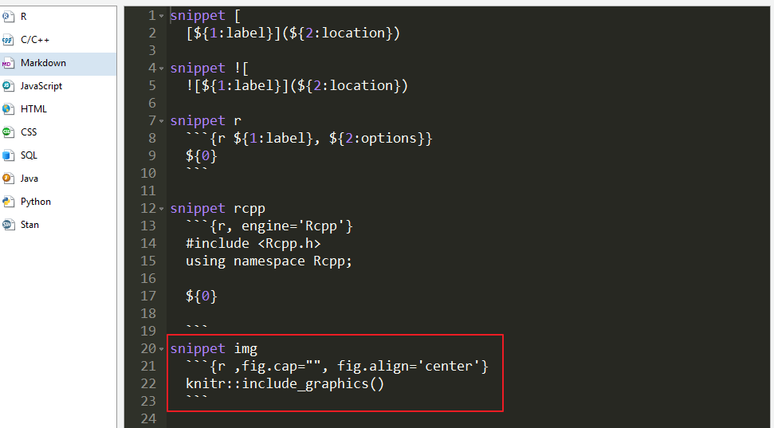

<!-- @import "[TOC]" {cmd="toc" depthFrom=1 depthTo=6 orderedList=false} -->
<!-- code_chunk_output -->

* [使用RStudio的一些高效方法](#使用rstudio的一些高效方法)
	* [常用快捷键](#常用快捷键)
	* [自定义代码块](#自定义代码块)

<!-- /code_chunk_output -->

# 使用RStudio的一些高效方法

## 常用快捷键

## 自定义代码块

第一步：打开Snippets
Tools > Global Options > Code > Snippets(藏在下方的小角落)

第二步：添加代码片段

选择编程语言，然后按照如下方式加入代码片段

第三步：使用shift+tab在编辑器中自动补全
