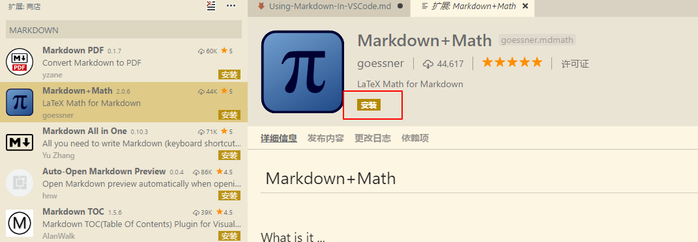
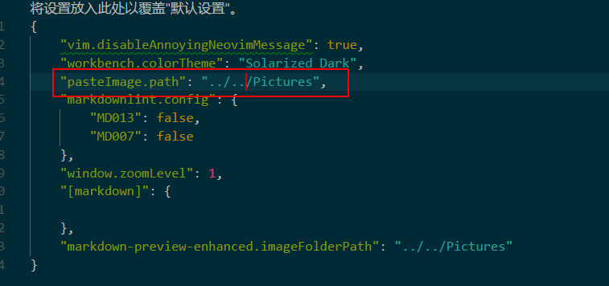
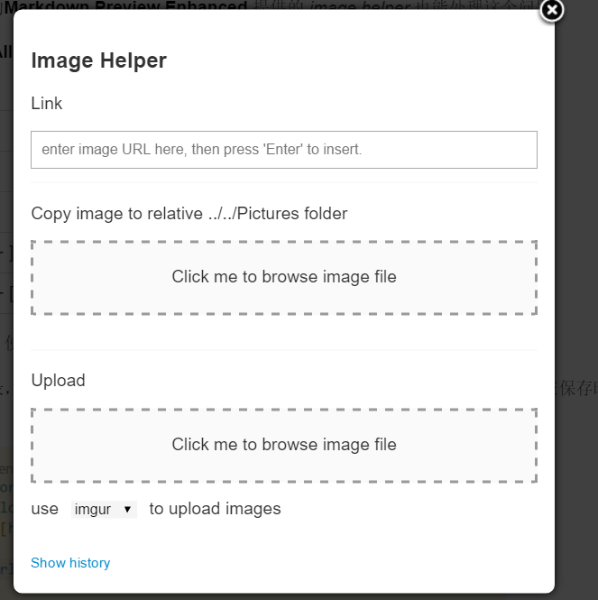
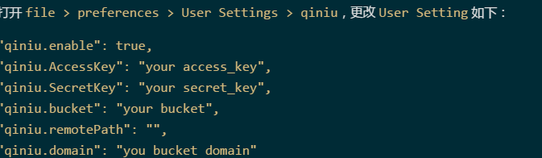

<!-- @import "[TOC]" {cmd="toc" depthFrom=1 depthTo=6 orderedList=false} -->
<!-- code_chunk_output -->

* [如何优雅地在VScode下进行Markdown写作](#如何优雅地在vscode下进行markdown写作)
	* [安装Visual Studio Code](#安装visual-studio-code)
		* [常用快捷键](#常用快捷键)
		* [插件安装方法：](#插件安装方法)
	* [笔记的组织形式：](#笔记的组织形式)
	* [笔记索引](#笔记索引)
	* [必备插件](#必备插件)
		* [markdownlint](#markdownlint)
		* [Markdown Shortcuts](#markdown-shortcuts)
		* [Markdown Preview Enhanced](#markdown-preview-enhanced)
		* [图片相关插件](#图片相关插件)

<!-- /code_chunk_output -->

# 如何优雅地在VScode下进行Markdown写作

## 安装Visual Studio Code

安装方式非常简单，到[https://code.visualstudio.com/Download](https://code.visualstudio.com/Download) 根据平台版本下载安装即可.

### 常用快捷键

如下是我目前用的最多的快捷键：

| 快捷键             | 功能                         |
| ----------------- | ---------------------------- |
| Ctrl + shift +P   | 打开命令版，用于查找命令     |
| ctrl + ,          | 用户自定义配置               |
| Ctrl + Shift +  K | 删除当前行                   |
| alt + 点击目标行   | 编辑多行                     |
| ctrl = shit + L   | 选择和选中内容相同的其他部分 |
| ctrl + \          | 分割编辑窗口                 |
| ctrl + w          | 关闭编辑窗口                 |
| ctrl + 1 / 2 /3   | 切换编辑窗口                 |

## 编辑器自定义

### 字体修改

字体分为markdown预览字体效果和编辑器字体效果。如果作为一个纯英文写作者，其实我也没有啥好纠结的，但是目前写作还是需要靠中文表达观点，所以就只能对编辑器字体做一些微小的工作了。对于Windows用户来说，可以设置成YaHei-Consolas-Hybrid，这是雅黑和Consolas的合并字体，中西文都有很好的显示效果。 字体大小，我设置成了16，毕竟老年人，视力不太好。

### 我的设置

以下是我编辑器的自定义的设置，包括插件修改部分。

```json
{
    "vim.disableAnnoyingNeovimMessage": true,
    "workbench.colorTheme": "Solarized Dark",
    "pasteImage.path": "../../Pictures",
    "markdownlint.config": {
        "MD013": false,
        "MD007": false,
        "MD004": false,
        "MD010": false
    },
    "window.zoomLevel": 1,
    "[markdown]": {
        "editor.quickSuggestions": true
    },
    "markdown-preview-enhanced.imageFolderPath": "../../Pictures",
    "qiniu.enable": true,
    "qiniu.AccessKey": "***************************************",
    "qiniu.SecretKey": "***************************************",
    "qiniu.bucket": "hoptop",
    "qiniu.domain": "oex750gzt.bkt.clouddn.com",
    "files.eol": "\n",
    "editor.fontFamily": "YaHei-Consolas-Hybrid, Consolas, 'Courier New', monospace",
    "editor.fontSize": 16
}
```

### 插件安装方法：

先用快捷键`ctrl + shift + X`调出插件安装界面后搜索插件，选择合适插件进行安装，比如说安装一个数学符号支持插件。



## 笔记的组织形式：

为了方便查找不同编辑，按照层次建立文件夹，并且根据需求进行修改。

```shell
笔记
├── Notes
│   ├── HTSToolkit
│   ├── Productive
│   │   └── Using-Markdown-In-VSCode.md
│   ├── Python
│   ├── R
│   ├── SQL
│   └── Unix
└──  Assets
```

这样做的好处是，方便查找，便于上传GitHub。

## 笔记索引

由于大多数情况下，我建立markdown是为了写笔记，而笔记最重要的一件事情是检索，所以在每段开头都要增加一些标签，还能直接用于hexo发布博客。

在VS code中创建Snppets: 首先在File(文件)>Preferences(首选项)>Snippets(用户代码片段)，选择markdown, 在新增加的`markdown.json`文件中增加如下内容

```json
{
"markdown title":{
    "prefix": "mdtitle",
    "body": [
        "---",
        "title:",
        "date:",
        "tags:",
        "categories:",
        "comments: true",
        "---"
    ],
    "description": "notes title"
}
}
```

这样子，就能调用ctrl+shift+p,然后`insert Snippt`，选择mdtitle,就能插入自动插入一段声明，然后加入日期，标签，分类等信息。

## 必备插件

### markdownlint

这个插件可以在你书写markdown时自动检查你的语法问题，使其符合一定的语法格式。对于我这个强迫症而言，简直要了我的老命，某一些感觉没有问题的代码，比如说多余的空格，它也会显示提示。于是我就不得不去修改。

### Markdown Shortcuts

提供了大量的markdown快捷键。包括如下特性：

* 快速创建有序或无需列表
* 便捷地生成URL
* 将类似于表格的内容转换成表格, 或生成一个用于填充的表格(Add table)
* 插入代码，行内代码`ctrl+M ctrl+I`, 代码块`ctrl+M ctrl+C`
* 加粗`ctrl +B` 斜体`ctrl + I`
* 加入检查盒(check box)

最后，使用`ctrl+m ctrl+m`显示可用命令。

### Markdown Preview Enhanced

功能超级强大，拥有如下特性：

* 自动生成目录，如果某一个标题需要排除，则添加`{ignore=ture}`
* 支持latex数学符号
    + `$...$` 或者 `\(...\)` 中的数学表达式将会在行内显示。
    + `$$...$$` 或者 `\[...\]` 或者 ```math 中的数学表达式将会在块内显示。
* 允许多种类型文档导出，HTML. PDF, Pandoc等等等。在预览时候右击就行了。
* 提供了额外的语法，如上下标，脚注等
* 支持mermaid, PlantUML, WaveDrom, GraphViz，Vega & Vega-lite，Ditaa 图像渲染
* 导入外部文件，这个也很厉害哦。 `@import your-file`
* 图片助手，预览模式下可以打开`Image helper`,就能从本地上传图片，也支持图床链接

**注**: 目前仍是测试版本。

### 图片相关插件

**图片问题**是我认为markdown写作时遇到的最大问题了。我需要两个特性：

- 支持图片直接复制，不需要它能够拖拉。
- 支持本地图片上传到图床，然后能够返回url连接

用图床避免发布到其他地方时还需要上传图片，当然本地还需要备份，否则图床倒闭就尴尬了。

首先使用`Markdown Paste Image`插件用于直接将复制的图片插入到文本中。为了便于管理，我将图片保存路径修改到Pictures下。使用`control + 逗号`打开配置。用户设置会覆盖默认设置。



后续只要截图之后，就可以用`ctrl+Alt+V`进行保存

或者，之前的**Markdown Preview Enhanced** 提供的 _image helper_ 也能处理这个问题



在本地保存的图片，还可以用插件`qiniu-fig-bed`上传到七牛云, 需要进行一些基本配置。


然后使用快捷键`ctrl + Q n` 将图片进行复制，就可用返回URL。依旧不太方便呀。

### evermonkey

印象猿，evermonkey，是一款印象笔记的第三方编辑插件，支持同步markdown笔记到印象笔记。

然而目前EverNote暂不支持Tokens，所以还是继续用为github同步我的笔记
