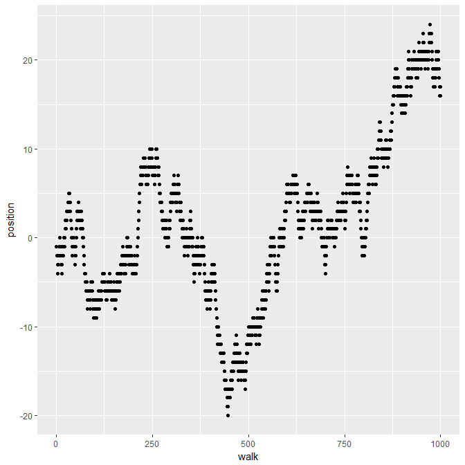
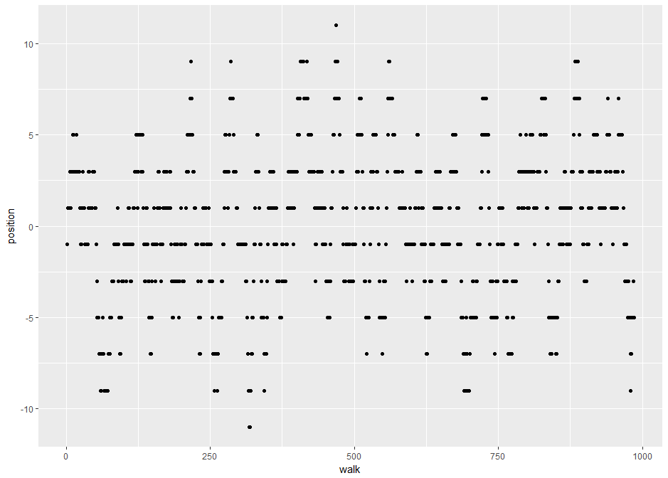

<!-- @import "[TOC]" {cmd="toc" depthFrom=1 depthTo=6 orderedList=false} -->
<!-- code_chunk_output -->

* [如何在R进行窗口聚合运算](#如何在r进行窗口聚合运算)
	* [窗口函数的类型](#窗口函数的类型)
		* [排名函数和排序函数](#排名函数和排序函数)
		* [偏移函数(offset)](#偏移函数offset)
		* [累计聚合](#累计聚合)
		* [循环聚合](#循环聚合)
		* [固定窗口长度滚动聚合](#固定窗口长度滚动聚合)

<!-- /code_chunk_output -->

# 如何在R进行窗口聚合运算

**window function**(窗口函数)是聚合运算函数的变体。聚合运算，如`sum()`和`mean()`接受多个输入返回单个输出，而窗口函数则是返回多个输出。

为了演示操作，我们使用的是 _Lahman batting_ 数据集，里面存放的是赢得奖牌的运动员信息。

```r
library(Lahman)

batting <- Lahman::Batting %>%
  as_tibble() %>%
  select(playerID, yearID, teamID, G, AB:H) %>%
  arrange(playerID, yearID, teamID) %>%
  semi_join(Lahman::AwardsPlayers, by = "playerID")

players <- batting %>% group_by(playerID)
```

窗口函数一般和`mutate()`和`filter`共同使用，用来解决问题, 因此你需要熟悉这两个函数。

## 窗口函数的类型

一共有5种主要的窗口函数，其中2类和聚合函数无关

- 排名(rank)和排序(order)函数：`row_number()`, `min_rank()`,`dense_rank()`, `cum_dist`, `percent_rank()`以及`ntile()`
- 偏移函数，`lead()`, `lag()` 允许你获取之前或者之后几个值，使得计算差异和趋势更加容易。

其他3类函数则是聚合函数的变种

- 累计聚合：来自于R基础包的`cumsum`,`cummin`,`cummax` 以及来自于dplyr的`cumall()`, `cumany()`和 `cummean()`
- 固定窗口长度滚动聚合：这类函数在_dplyr_和_base_里都没有，但是可以在_RcppRoll_ 包里找到。
- 循环聚合， 由于R的自动补全特性，所以不需要特定的函数。

### 排名函数和排序函数

不同排名函数的差异仅仅子啊与他们如何处理结(ties)，也就是出现了相同的排名如何处理。

```r
x <- c(1,1,2,3,2)
row_numer(x)
# 1 2 3 5 4
min_rank(x)
# 1 1 3 5 3
dense_rank(x)
# 1 1 2 3 2
```

除此之外，还有`percent_rank`以百分比排名，`cune_dist()` 给出小于等于当前值的比例。

```r
cume_dist(x)
# 0.4 0.4 0.8 1.0 0.8
percent_rank(x)
# 0.0 0.0 0.5 1.0 0.5
```

如果你想选择每一组的前10%，这个就特别有用了

```r
filter(players, cume_dist(desc(G)) < 0.1)
```

`ntile()`将数据均等分为_n_组。 它可以和`mutate()`连用将数据分为多个小组()buckets，用于进一步的汇总。比如说，我们可以使用`ntile()`将同一个队伍里的players分为4个排序组，然后计算每个小组的平均游戏数

```r
batting %>% group_by(teamID, playerID) %>%
  summarise(G = sum(G)) %>%
  group_by(quartile = ntile(G,4)) %>%
  summarise(mean(G))
# A tibble: 4 x 2
#  quartile `mean(G)`
#     <int>     <dbl>
#        1  27.23415
#        2  97.43232
#        3 271.02506
#        4 974.76370
```

### 偏移函数(offset)

`lead()`和`lag()`产生输入矩阵的偏移后结果，如下

```r
lead(x, n=1)
#[1]  2  3  4  5 NA
lag(x,n=1)
#[1] NA  1  2  3  4
```

那么问题来了，知道这两个函数对数据分析有啥用？

- 计算相对变化 `mutate(player, G_delata = G - lag(G))`. 这里使用`lag()`会比`diff()`更加高效
- 发现何时值发生变化 `filter(palyers, teamID != lag(teamID))`

`lead()`和`lag()`有一个可选参数，`order_by`. 使用之后就换用另一种方法确定数值的前后顺序，一般用于原始数据未排序时。

### 累计聚合

基础R包提供了累计求和`cumsum()`, 累计最小值`cummin()`和累计最大值`cummax()`, 以及累积的或与且`cuman()`，`cumall()` 和累计均值`cummean()`。 这里以**random walks**为例，展示一下累计聚合中`cumsum()`的用法。

所谓的**random walk**就是每一次行走的步长是1或-1，而第n步所在的位置都是之前的累加。

```r
nsteps <- 1000
steps <- ifelse(rnorm(nsteps) > 0 , 1, -1)
walks <- cumsum(steps)
df <- data.frame(walk = seq(1,1000,1), position = walks )
ggplot(df, aes(walk, position)) + geom_point()
```



### 循环聚合

R的向量化运算能方便选择大于或小于描述性统计结果的值，也就是循环补齐聚合，因为它能将将不同长度的向量进行补齐然后进行比较。比如说我们可以选择最大值或最小值

```r
# 添加职业生涯
mutate(players, career_year = yearID - min(yearID) + 1)
# 计算z-scores
mutate(players, G_z = (G-mean(G))/sd(G))
```

### 固定窗口长度滚动聚合

这一类函数由 _RcppRoll_ 包提供，提供了如下函数，用于对指定window长度的值进行聚合运算。

- roll_max
- roll_mean
- roll_median
- roll_min
- roll_prod
- roll_sd
- roll_sum
- roll_var

比如之前**ramdom walks**,就可以计算每15步的位置

```r
nsteps <- 1000
steps <- ifelse(rnorm(nsteps) > 0 , 1, -1)
walks <- roll_sum(steps,n=15)
df <- data.frame(walk = seq(1,986,1), position = walks )
ggplot(df, aes(walk, position)) + geom_point()
```

每个值都会根据前面15步计算当前位置，因此结果图就很奇妙了。

