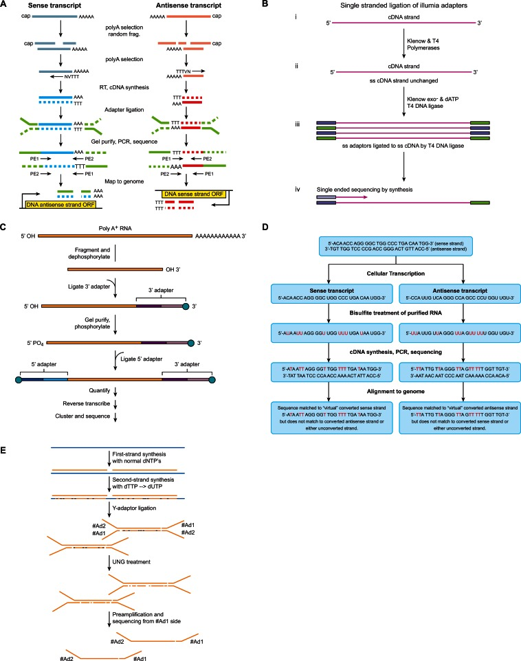

<!-- @import "[TOC]" {cmd="toc" depthFrom=1 depthTo=6 orderedList=false} -->
<!-- code_chunk_output -->

* [植物非编码RNA数据分析](#植物非编码rna数据分析)
	* [数据准备](#数据准备)

<!-- /code_chunk_output -->

# 植物非编码RNA数据分析

非编码RNA数据分析可以分为以下几步：

1. 数据准备: 文库准备和测序或数据下载
1. 测序数据质量控制
1. 参考基因组（转录组）比对
1. lncRNA _de novo_ 发现
1. lncRNA 表达水平计数
1. 找到差异表达的lncRNA
1. lncRNA功能分析
1. lncRNA-mRNA 共表达网络(co-expression network)
1. lncRNA-miRNA 互作分析
1. 组蛋白修饰和lncRNA表达

## 数据准备

数据准备分为两种类型，一种是自己抽提总RNA送给公司制备文库然后测序，一种是下载已有的数据。

lncRNA文库制备和普通mRNA建库的异同如下：

- lncRNA先要从总RNA中去除rRNA(一般不需要去除poly A RNA)。而mRNA则是用Oligo(dT)对mRNA进行富集(真核生物的成熟mRNA 5'加帽，3'是polyA)
- RNA片段化. 根据lncRNA定义，长度在200~500 nt之间, mRNA长度一般在200 bp ~ 10 k 之间。
- 之后打碎后的mRNA片段只需要添加随机六聚体选择一定长度进行PCR后上机测序。而lncRNA大部分都是来自于反义链，并且大部分位于不含核小体的区域

