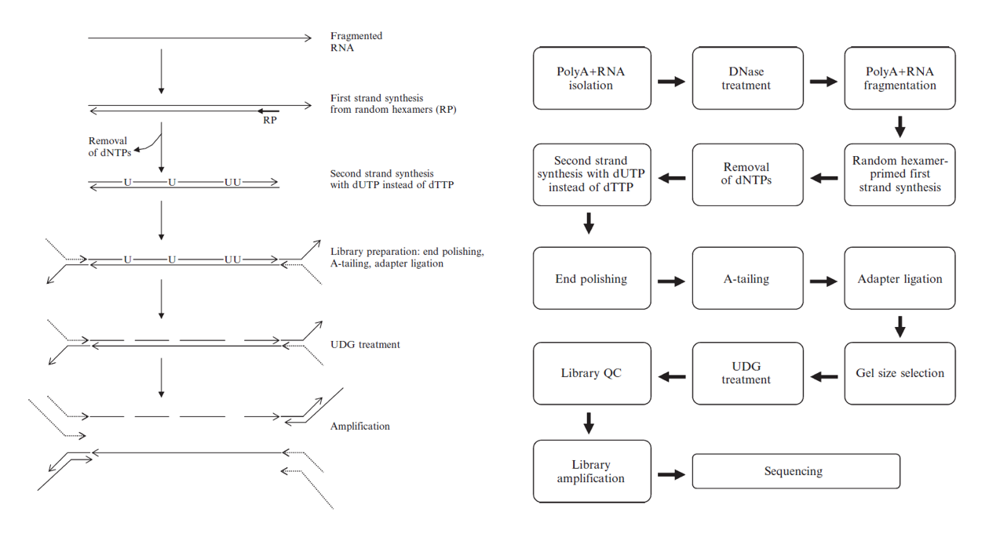

<!-- @import "[TOC]" {cmd="toc" depthFrom=1 depthTo=6 orderedList=false} -->
<!-- code_chunk_output -->

* [植物非编码RNA数据分析](#植物非编码rna数据分析)
	* [数据准备](#数据准备)
	* [下机数据质量控制(quality control)](#下机数据质量控制quality-control)

<!-- /code_chunk_output -->

# 植物非编码RNA数据分析

非编码RNA数据分析可以分为以下几步：

1. 数据准备: 文库准备和测序或数据下载
1. 测序数据质量控制
1. 参考基因组（转录组）比对
1. lncRNA _de novo_ 发现
1. lncRNA 表达水平计数
1. 找到差异表达的lncRNA
1. lncRNA功能分析
1. lncRNA-mRNA 共表达网络(co-expression network)
1. lncRNA-miRNA 互作分析
1. 组蛋白修饰和lncRNA表达

## 数据准备

数据准备分为两种类型，一种是自己抽提总RNA送给公司制备文库然后测序，一种是下载已有的数据。

lncRNA分析需要准备链特异性文库(strand-specific library) , 这与普通mRNA建库的异同如下：

- lncRNA先要从总RNA中去除rRNA(一般不需要去除poly A RNA)。而mRNA则是用Oligo(dT)对mRNA进行富集(真核生物的成熟mRNA 5'加帽，3'是polyA），当然富集mRNA，相当于是去除rRNA。
- RNA片段化. 根据lncRNA定义，长度在200~500 nt之间, mRNA长度一般在200 bp ~ 10 k 之间。
- 之后打碎后的mRNA片段只需要添加随机六聚体选择一定长度进行PCR后上机测序，于是正反双链都会被测到。但是链特异性文库则会仅送**一条链**测序，原理如下。



链特异性文库制备方法^[A Strand-Specific Library Preparation Protocol for RNA Sequencing]

## 下机数据质量控制(quality control)

在正式分析之前先要去除一些dirty raw reads，也就是含接头(短片段会被测过头),含N过多或喊大量低质量碱基(机器可能还没有热身)，最后仅仅使用clean reads。换种语言讲就是: Filtering includes removing adaptor sequences, contamination and low-quality reads from raw reads. 不同软件参数可能不同，但是一般要求如下，可以在此基础上进行调整。

1. 去除含adapter的reads(reads中接头污染的碱基数大于5bp。对于双端测序，若一端受到接头污染，则去掉两端的reads)；
1. 去除含N比例大于5%的reads(对于双端测序，若一端含N比例大于5%，则会去掉两端reads)；
1. 去除低质量reads (质量值Q≤20的碱基数占整条read的20％以上,对于双端测序，若一端为低质量reads，则会去掉两端reads).

这几个步骤用到的软件为TrimGalore(整合了Cutadapt和FastQC)

```shell
# need fastqc and cutadapt installed before
conda install -c bioconda trim-galore
```

lengthsort， dynamicTrim， bbmap.