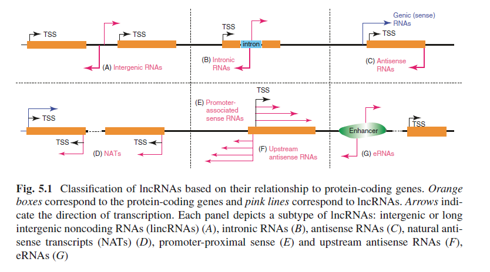
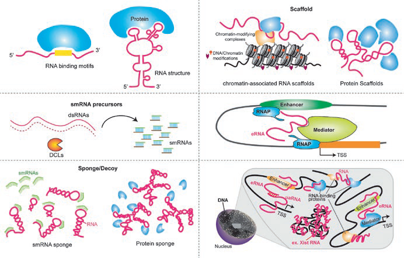

<!-- @import "[TOC]" {cmd="toc" depthFrom=1 depthTo=6 orderedList=false} -->
<!-- code_chunk_output -->

* [植物中的非编码RNA](#植物中的非编码rna)
	* [背景介绍](#Introduction)
	* [研究进展](#Advance)
	* [植物lncRNA的分子功能](#植物lncrna的分子功能)
	* [其他](#其他)

<!-- /code_chunk_output -->

# 植物中的非编码RNA

本文为[Long Noncoding RNAs in Plants](https://link.springer.com/chapter/10.1007%2F978-981-10-5203-3_5)学习笔记，几乎等于全文翻译。

## 背景介绍 {#Introduction}

基因调节的**基本原则**就是它由调节因子控制，而调节因子能在蛋白质合成之前的某些阶段与特定的DNA或RNA种的序列或结构发生相互作用。可控表达阶段包括：

- 转录过程：调节靶标是DNA，起始、延伸或终止阶段，**调节因子**可以是蛋白或RNA
- 翻译过程：调节靶标是RNA

“可控的”含义就是调节因子可关闭（阻遏）或开启（激活）靶标。

对真核生物的转录组研究表明，基因组90%以上都可以转录，并且绝大部分转录本都是非编码RNA(noncondig RNA, ncRNA)。当然这其中就包括大于200 nt 且不具有存在编码能力的非编码RNA(long ncRNA).

植物的lncRNA来自于基因间隔区(intergenic)，内含子(intronic)，或编码区(coding region)。 RNA聚合酶II（Pol II)从正义链和反义链里转录出大部分lncRNA，两外还有聚合酶IV，聚合酶V以及两个植物特异性RNA聚合酶。植物目前所记录的lncRNA大部分是**多聚腺苷酸化**(polyA)，然而在酵母和人类中lncRNA大多为**非多聚腺苷酸化**。不过也在植物中发现了许多具有重要功能的lncRNA, 研究发现拟南芥在逆境条件下会诱导上百种**非多聚腺苷酸**的lncRNA.

lncRNA还可以根据其与蛋白编码基因的关系继续分类,见下图：

植物中在TSS^[TSS, Transcription stat site]邻近 lncRNA的研究上还有很大空间。利用GRO-Seq^[GRO-Seq, global nuclear run-on sequencing]，5' GRO-Seq 和 RNA-Seq 分析拟南芥苗期的早期RNA(nascent RNA)，也没有找到上游反义TSS邻近的ncRNA。
也就是说，相对于其他真核生物，拟南芥以及玉米有可能缺少不同的转录(divergent transcription)，意味着真核生物的启动子并不是双向继承(inherently bidirectional). 在RNA 外切体缺陷型发现的TSS-proximal lncRNA 包括上游分编码转录本(upstream noncoding transcrips, UNT)，它转录成正义RNA，并且和蛋白编码基因的5' 端共线性(colinear)，延伸成第一个内含子。UNT类似于酵母的CUT和哺乳动物的PROMPT^[Genome-wide high-resolution mapping of exosome substrates reveals hidden features in theArabidopsis transcriptome] 。

来源于增强子区域的外切题敏感增强子RNA(exosome-sensitive enhancer RNA, eRNA)在哺乳动物细胞中占据了非多聚腺苷酸化lnRNA绝大部分。 然而对eRNA的研究才刚刚开始，染色质印记(chromatin signatures)研究预测了超过10,000多个植物基因间区的增强子^[Genome-wide prediction and validation of intergenic enhancers in Arabidopsis using open chromatin signatures]

## 研究进展 {#Advance}

哺乳动物的lncRNA目前已经有了很好的研究，植物近些年来只能说有了长足进步，数据库终于多了起来。

数据库 | 描述 | 网站 |
---------|----------|---------
 TAIR | Arabidopsis thaliana综合性数据库 | <https://www.arabidopsis.org/>
 Araport11 | Arabidopsis Col-0 version 11, 相对于TAIR10多了额外的编码和非编码注释 | <https://www.araport.org/>
 PLncDB | 包含了超过13,000 lincRNA | <http://chualab.rockefeller.edu/gbrowse2/homepage.html>
 GREENC | 超过120,000 lincRNA注释信息 | <http://greenc.sciencedesigners.com/wiki/Main_Page>
 NONCODE V4.0 | 超过500,000 lncRNAs注释信息，主要是人类和小鼠 | <http://www.noncode.org/index.php>
 CANTATAdb|来源于10个模式植物的 45,000 植物lncRNA| <http://cantata.amu.edu.pl/>
 PNRD|来源于150个植物物种,超过25,000 ncRNA| <http://structuralbiology.cau.edu.cn/PNRD/>
 PlantNATsDB|自然翻译转录本数据库| <http://bis.zju.edu.cn/pnatdb/>

lincRNA在不同组织和逆境下的表达量水平具有很大差异，意味着 lncRNA接受动态调节，并受到发育和逆境相应的调节。比如说NAT就是组织特异性且在生物或非生物胁迫下表达量会发生改变。

拟南芥和水稻还有中等长度的非编码RNA(im-ncRNA),长度在50-300 nt，产生于5‘ UTR，编码区和内含子。与5' UTR im-ncRNA 相关的基因倾向于有着更好的表达量和H3K4me3.H3K9ac组蛋白标记（与转录激活相关）。植物的部分im-ncRNA 表达降低后会有发育表型或可检测的分子标记改变^[Genomic features and regulatory roles of intermediate-sized non-coding RNAs in Arabidopsis]

目前主要是研究lncRNA的作用，但是lncRNA本身的调节机制的研究还很有限。毕竟lncRNA也要经过转录水平调节。

## 植物lncRNA的分子功能

和mRNA相比，lncRNA的序列保守性较低，表达量也不高。不难理解大家会认为它并没有那么重要，也没有必要对它进行研究，说不定只是转录噪音而已。实际上，它的功能也有很大争议。好消息是，近些年来已经有证据表明许多lncRNA作用于真核生物细胞多种分子进程(molecular processes)。在植物中至少扮演如下角色，

- 基因沉默
- 开花时期调节
- 根部器官发生
- 苗期光形态建成
- 非生物胁迫
- 生殖

lncRNA的工作机制如下图所示：

图解：
a. lncRNA可能需要特异性的基序(sequence motifs)或者二级结构才能行使功能
b. lncRNA, 尤其是双链转录本可在RNA干扰通路中作为smRNA的前导(precursors)
c. lncRNA可作为脚手架用于招募chromatin-modifying factors，或者作为其他蛋白复合体的组装平台。
d. lncRNA可作为smRNA的分子海绵^[molecular sponges]或诱饵(decoys), 也能和RNA结合蛋白同归于尽(titrate away)
e. eRNA来自于增强字，受外切体(exosome)调节，可以与DNA其他区域（增强子或启动子）互作，影响局部DNA的拓扑结构，从而调节基因表达。
f. lncRNA能与一些染色质重构蛋白和染色质区域互作，从而影响高级核结构

下表列出目前研究比较清楚的植物lncRNA的功能和工作机制

lncRNAs| 描述 | 参考文献
---------|----------|---------
 ASCO-lncRNA | Functions in lateral root development in Arabidopsis. Regulator of alternative splicing. Works as a decoy lncRNA | ^[Long noncoding RNA modulates alternative splicing regulators in Arabidopsis]
 IPS1 | Functions in regulating phosphate balance and phosphate starvation response in Arabidopsis. Competes with PHO2 mRNA for interaction with miR399 and acts as non-cleavable miRNA target | ^[Target mimicry provides a new mechanism for regulation of microRNA activity]
 HID1 | Functions in regulation of photomorphogenesis in Arabidopsis seedlings. Trans-acting lncRNA (236 nt) acts by associating with the PIF3 promoter and represses its transcription. Evolutionary conserved in land plants | ^[Arabidopsis noncoding RNA mediates control of photomorphogenesis by red light]
 COOLAIR | Functions in regulation of flowering in Arabidopsis in both vernalization and autonomous pathways. Modulates FLC expression by multiple mechanisms | ^[Cold-induced silencing by long antisense transcripts of an Arabidopsis polycomb target.]
 COLDAIR | Functions in regulation of flowering in Arabidopsis in the vernalization pathway. Associates with Polycomb to mediate silencing of FLC and affects chromatin looping at FLC in response to vernalization | ^[Vernalization-mediated epigenetic silencing by a long intronic noncoding RNA. Science]
 COLDWRAP | Functions in regulation of flowering in Arabidopsis in the vernalization pathway. Participates in and coordinates vernalization-mediated Polycomb silencing of the FLC. Also affects formation of an intragenic chromatin loop that represses FLC | ^[Vernalization-triggered intragenic chromatin loop formation by long noncoding RNAs]
 ASL | Functions in regulation of flowering in the autonomous pathway in Arabidopsis. AtRRP6L regulates ASL to modulate H3K27me3 levels. |^[Arabidopsis RRP6L1 and RRP6L2 function in FLOWERING LOCUS C silencing via regulation of antisense RNA synthesis.]
 APOLO | Functions in regulation of auxin signaling outputs in Arabidopsis. Participates in chromatin loop dynamics. Affects formation of a chromatin loop in the PID promoter region | ^[Noncoding transcription by alternative RNA polymerases dynamically regulates an auxin-driven chromatin loop.]
 Pol IV transcripts| Technically shorter in length than the standard lncRNAs. Function in silencing of transposons (TEs) and repeats in RdDM pathway. Serve as precursors for siRNAs in RdDM pathway | ^[Detection of Pol IV/RDR2-dependent transcripts at the genomic scale in Arabidopsis reveals features and regulation of siRNA biogenesis]
 Pol V transcripts | Function in silencing TEs and repeats in RdDM pathway. Serve as a scaffold lncRNAs for assembly of siRNAs and proteins in RdDM pathway | ^[Long non-coding RNA produced by RNA polymerase V determines boundaries of heterochromatin.]
 ENOD40 | Functions in regulation of symbiotic interactions between leguminous plants and soil bacteria in Medicago truncatula. Suggested to function in re-localization of proteins in plants | ^[Enod40, a short open reading frame-containing mRNA, induces cytoplasmic localization of a nuclear RNA binding protein in Medicago truncatula.]
 LDMAR  | Regulates photoperiod-sensitive male sterility in rice by affecting DNA methylation in the LDMAR promoter region. The precise mechanism of LDMAR function and the interaction between LDMAR and siRNAs remain to be clarified   | ^[long noncoding RNA regulates photoperiod-sensitive male sterility, an essential component of hybrid rice]

## 其他

植物LincRNA研究可以关注蔡南海实验室